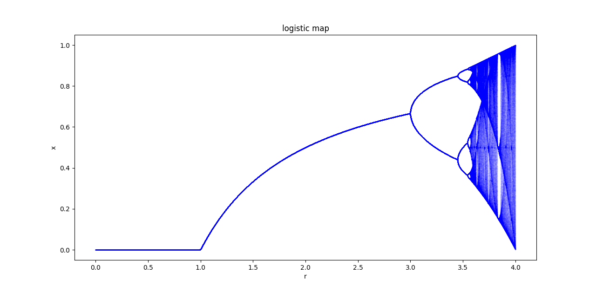
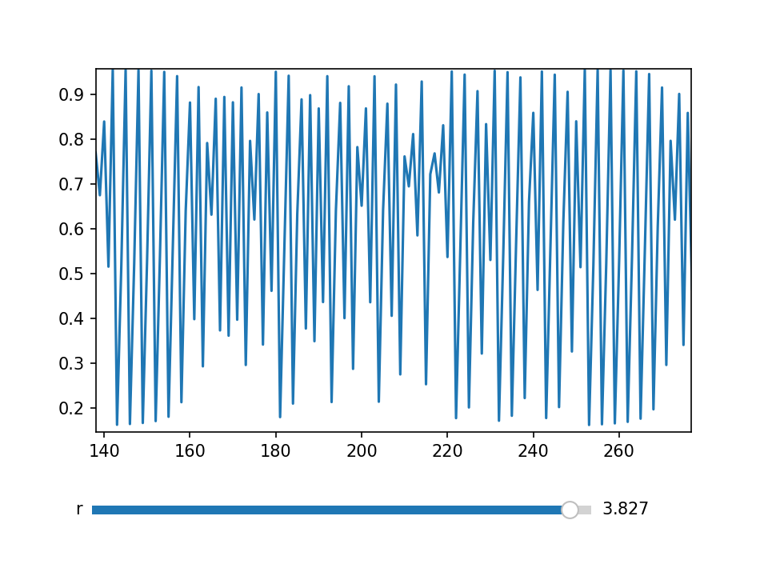

  

# Logistic-Map
I created this program to study the behaviour of logistic maps

My main concern when studying the logistic map is the 3-cycle at the point $r = 1 + 2\sqrt 2$ and it's brances and period doubling

.png)
